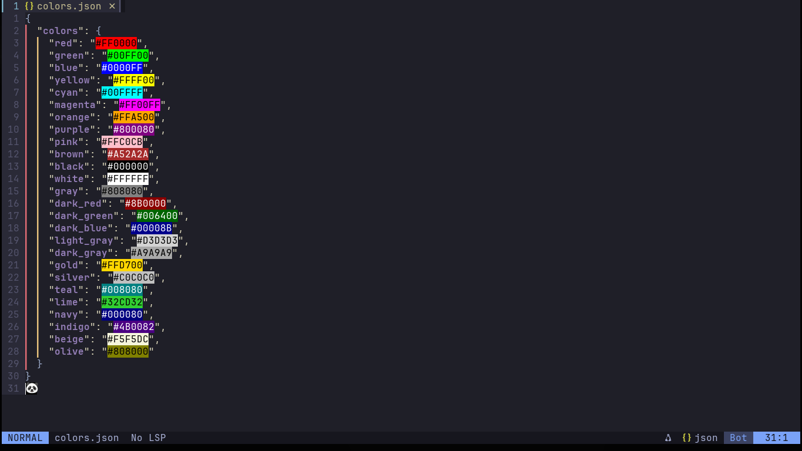

#  **Neovim Customizado**

Este é um **setup customizado do Neovim**, projetado para oferecer uma experiência moderna e produtiva. Ele vem com um **script de instalação automatizado**, permitindo que você configure tudo com facilidade.

---

### 🛠️ **Requisitos**

- **Neovim** 0.9.5 ou superior.
- **Git**

---

### 🚀 **Funcionalidades**

Este setup oferece uma ampla gama de funcionalidades modernas e úteis, incluindo:

1. **Dashboard**: Uma tela inicial interativa.
2. **Gerenciamento de Tarefas**: Integração com `Todo Comments`.
3. **Editor de Código**: Completo com realce de sintaxe, snippets e muito mais.
4. **Suporte a Autocomplete**: Usando `Mason` e `cmp_nvim_lsp` para sugestões inteligentes.
5. **Terminal Integrado**: Com `ToggleTerm` para facilitar o uso.
6. **Realce de Cores**: Configuração completa para color highlights.
7. **Auto formatação**: Ao salvar um arquivo ele se auto formata.

  
Clique para expandir e ver as imagens de demonstração 📸

  - **Dashboard**
    

  - **Gerenciamento de Tarefas**
    

  - **Editor de Código**
    

  - **Autocomplete**
    

  - **Terminal Integrado**
    

  - **Color Highlights**
    

---
