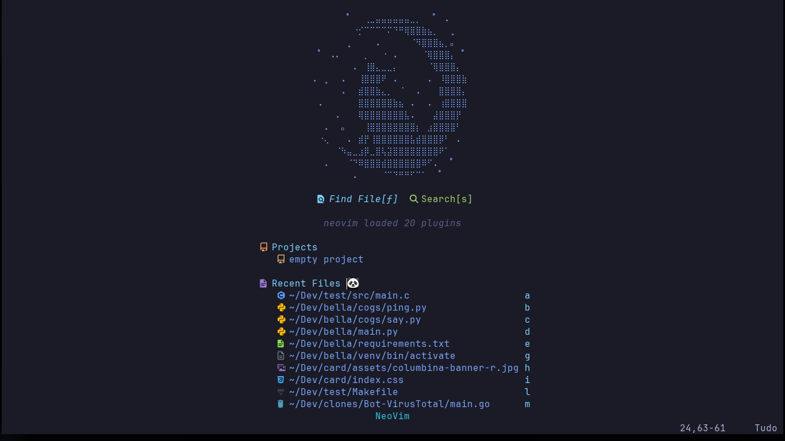
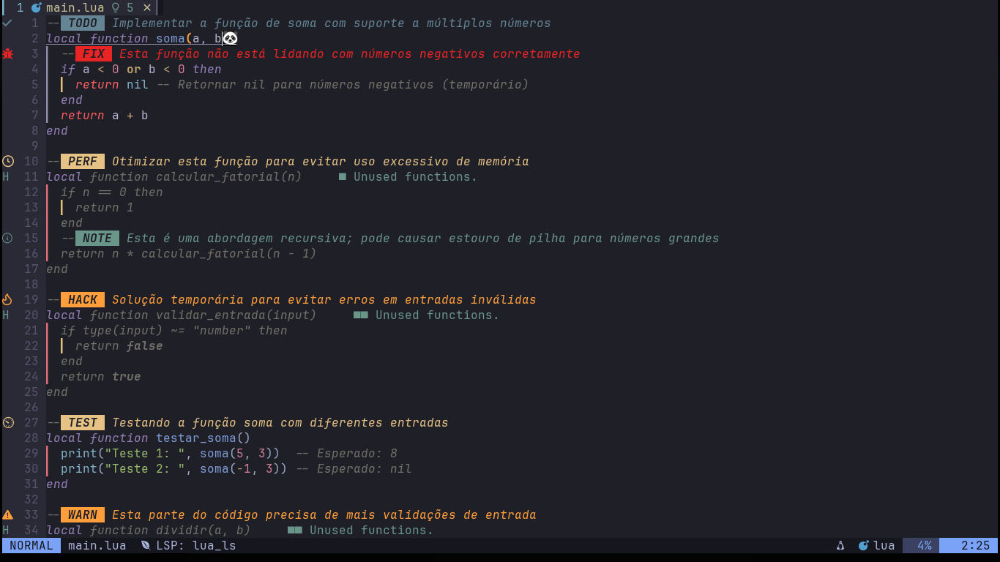
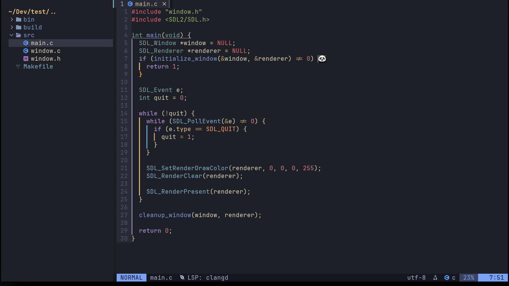
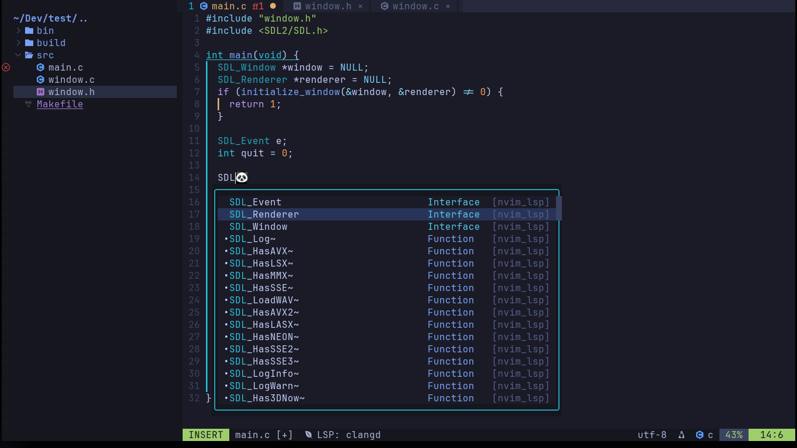
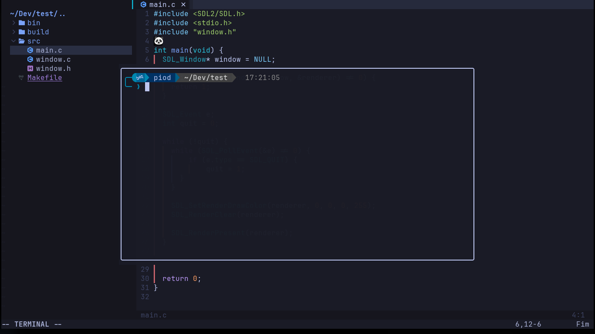
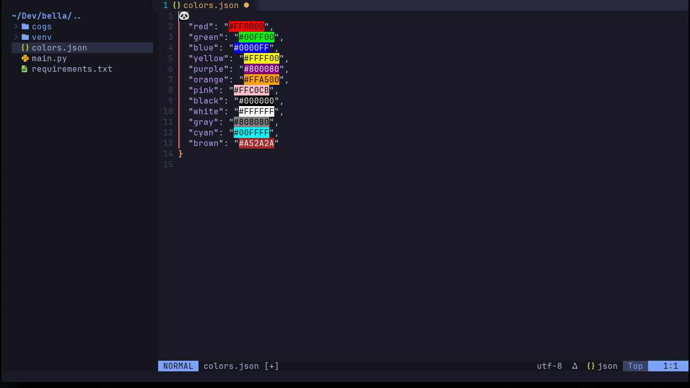

#  **Neovim Customizado**

Este é um **setup customizado do Neovim** com funcionalidades modernas para melhorar sua produtividade ao codar. Agora, com um **script de instalação automatizado**, você pode configurar tudo facilmente com apenas alguns comandos.

---

### 🛠️ **Requisitos**

- Neovim 0.9.5 ou superior.

---

### 🚀 **Funcionalidades**

#### 1. **Dashboard**

  
Clique para ver a tela inicial (Dashboard)

  

#### 2. **Gerenciamento de Tarefas (Todo Comments)**

  
Clique para ver a integração do Todo Comments

  

#### 3. **Editor de Código**

  
Clique para ver o Editor de Código

  

#### 4. **Suporte a Autocomplete (LSP e cmp_nvim_lsp)**
Usa **Mason** para instalação fácil de servidores LSP e integração com **cmp_nvim_lsp** para sugestões contextuais.

  
Clique para ver o Autocomplete

  

#### 5. **Terminal Integrado (ToggleTerm)**

  
Clique para ver o Terminal Integrado

  

#### 6. **Color Highlights**

  
Clique para ver as color highlights

  

---

### 🔧 **Instalação Automática**

Agora, você pode configurar o seu ambiente de desenvolvimento de forma rápida e simples com o script de instalação automatizado. Basta rodá-lo no terminal e o Neovim será configurado com todas as funcionalidades que você precisa!

---
